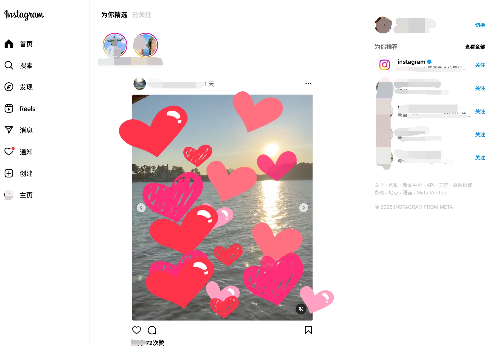
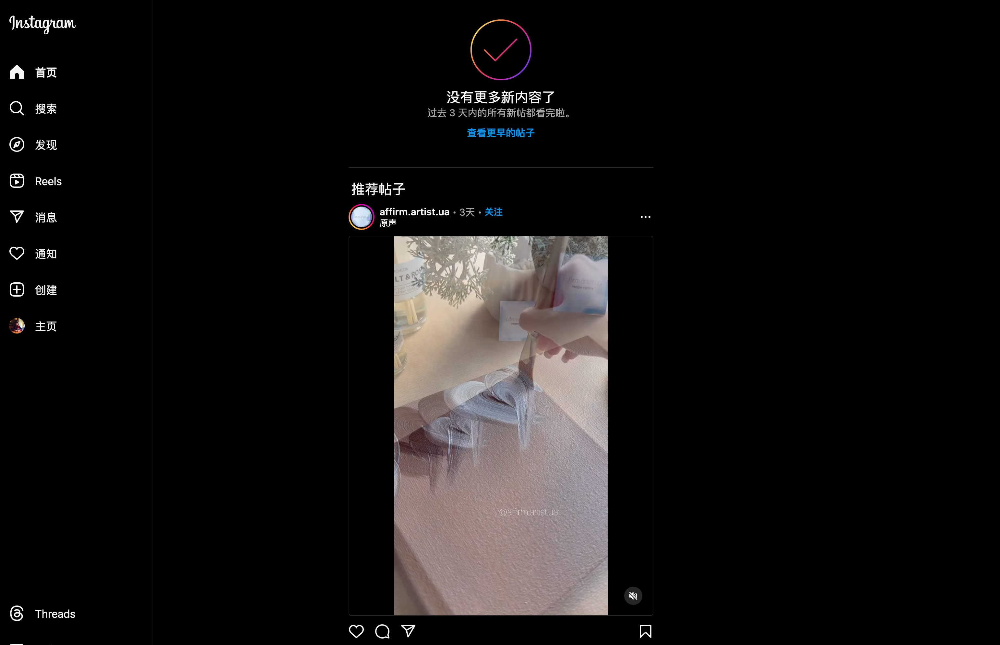

Färganalys av webbplatser
=======================

Den här rapporten handlar om att analysera färganvändning och typografi på tre olika webbplatser: Coca-Cola, Instagram och Airbnb. Målet är att förstå hur dessa webbplatser använder färger och typografi för att stärka sina respektive varumärkesprofiler.

Urval
-----------------------

Jag valde dessa tre webbplatser eftersom de representerar olika branscher och stilar:
	1.	Coca-Cola: En global ikon som använder färger för att skapa igenkänning.
	2.	Instagram: Ett socialt medium med fokus på kreativa och moderna färgscheman.
	3.	Airbnb: En plattform för boenden och upplevelser med en varm och inbjudande estetik.

Mitt mål var att analysera hur olika företag använder färger och typografi för att nå sina målgrupper.

Metod
-----------------------

För att genomföra färganalysen använde jag följande:

1. Verktyg:
   - Adobe Color: För att identifiera exakta färgkoder.
   - WhatFont: För att identifiera och analysera typsnitt.
   - Skärmbilder: Dokumenterade varje webbplats utseende.

2. Arbetssteg:
   - Tog skärmbilder av startsidan på varje webbplats.
   - Analyserade deras färgpaletter och typsnitt för H1-H3 och brödtext.
   - Jämförde resultaten för att identifiera trender och avvikelser.

Resultat
-----------------------

1. Coca-Cola

	

	Färgpalett:
	<table style="border-spacing: 4px; border-collapse: separate">
	<tr>
	<td style="height: 50px; width: 50px; background-color: #73030D"></td>
	<td style="height: 50px; width: 50px; background-color: #400207"></td>
	<td style="height: 50px; width: 50px; background-color: #BF0404"></td>
	<td style="height: 50px; width: 50px; background-color: #F20707"></td>
	<td style="height: 50px; width: 50px; background-color: #F2F2F2"></td>
	</tr>
	</table>

	- Färgschema: Monokromatiskt med rött som dominerande färg.
	- Typografi:
		- H1-H3: Noto-regional, Noto-latin, TCCC-UnityText, sans-serif.
		- Brödtext: Noto-regional, Noto-latin, TCCC-UnityText, sans-serif.
	- Sammanfattning: Coca-Colas klassiska röda färg är central och används för att skapa en stark och igenkännbar varumärkesidentitet. Den enhetliga användningen av samma typsnitt för både rubriker och brödtext förstärker den konsekventa visuella kommunikationen och gör varumärket lätt att känna igen globalt.

2. Instagram

	

	Färgpalett-daytime:
	<table style="border-spacing: 4px; border-collapse: separate">
	<tr>
	<td style="height: 50px; width: 50px; background-color: #F20C78"></td>
	<td style="height: 50px; width: 50px; background-color: #D504D9"></td>
	<td style="height: 50px; width: 50px; background-color: #0597F2"></td>
	<td style="height: 50px; width: 50px; background-color: #F2B705"></td>
	<td style="height: 50px; width: 50px; background-color: #F2F2F2"></td>
	</tr>
	</table>

	

	Färgpalett-night:
	<table style="border-spacing: 4px; border-collapse: separate">
	<tr>
	<td style="height: 50px; width: 50px; background-color: #D504D9"></td>
	<td style="height: 50px; width: 50px; background-color: #0597F2"></td>
	<td style="height: 50px; width: 50px; background-color: #F2C849"></td>
	<td style="height: 50px; width: 50px; background-color: #A68C8A"></td>
	<td style="height: 50px; width: 50px; background-color: #0D0D0D"></td>
	</tr>
	</table>

	- Färgschema: Gradient med en blandning av varma och kalla toner.
	- Typografi:
		- H1-H3: -apple-system, "system-ui", "Segoe UI", Roboto, Helvetica, Arial, sans-serif
		- Brödtext: -apple-system, "system-ui", "Segoe UI", Roboto, Helvetica, Arial, sans-serif
	- Sammanfattning: Gradienten används för att skapa en ungdomlig och kreativ känsla som passar plattformens målgrupp.

3. Airbnb

	

	Färgpalett:
	<table style="border-spacing: 4px; border-collapse: separate">
	<tr>
	<td style="height: 50px; width: 50px; background-color: #F23869"></td>
	<td style="height: 50px; width: 50px; background-color: #4F7302"></td>
	<td style="height: 50px; width: 50px; background-color: #F29F05"></td>
	<td style="height: 50px; width: 50px; background-color: #BF5B45"></td>
	<td style="height: 50px; width: 50px; background-color: #F2F2F2"></td>
	</tr>
	</table>

	- Färgschema: En varm och livfull palett med fokus på vänlighet och tillgänglighet.
	- Typografi:
		- H1-H3: "Airbnb Cereal VF", Circular, -apple-system, "system-ui", Roboto, "Helvetica Neue", sans-serif
		- Brödtext: "Airbnb Cereal VF", Circular, -apple-system, "system-ui", Roboto, "Helvetica Neue", sans-serif
	- Sammanfattning: Airbnb:s färger och typsnitt skapar en inbjudande känsla som passar deras mål att vara en plattform för gemenskap och  upplevelser.

Analys
-----------------------

De tre webbplatserna har tydligt genomtänkta färgval som förstärker deras varumärkesprofiler.

Coca-Cola

Coca-Colas användning av den ikoniska röda färgen signalerar energi, passion och styrka. Färgen rött har en väl dokumenterad psykologisk effekt av att dra till sig uppmärksamhet och skapa känslor av spänning och entusiasm (Verywell Mind, 2023). Detta passar perfekt för Coca-Colas mål att vara ett globalt varumärke med stark igenkänning.

Enligt dbwebb.se (2023) skapas ett monokromatiskt färgschema genom att använda olika variationer av samma färg med olika nivåer av mättnad och ljusstyrka. Coca-Cola använder denna metod genom att kombinera sin röda färg med nyanser av vitt och ljusgrått. Detta bidrar till en konsekvent och fokuserad design som förstärker varumärkets identitet och gör det omedelbart igenkännbart för konsumenter världen över.

Instagram

Instagrams gradientfärgschema med varma och kalla toner skapar en ungdomlig och kreativ känsla. Gradienten förstärker dynamik och mångsidighet, vilket är perfekt för en plattform som fokuserar på kreativt innehåll och användargenererat material (Webdesign.tutsplus, 2023). Enligt dbwebb.se (2023) kan färgval användas för att kommunicera med specifika målgrupper, vilket Instagram gör genom sitt moderna och dynamiska gradientfärgschema. Instagrams nattläge kompletterar gradientfärgschemat genom att använda mörkare och mer dämpade toner, vilket minskar ögonbelastningen och förbättrar användarupplevelsen i lågljusa miljöer. Detta är i linje med principerna för mörkt läge, där kontrast och läsbarhet prioriteras (CSS-Tricks, 2023).

Airbnb

Airbnb:s färgpalett består av varma och livfulla toner som signalerar gemenskap, trygghet och tillgänglighet. Enligt Huevaluechroma (2023) används varma färger som rött och orange ofta för att skapa en känsla av välkomnande och värme. Airbnb:s användning av färger i kombination med deras typsnitt Circular, sans-serif, förstärker känslan av inbjudande estetik och passar väl för deras mål att vara en plattform för gemenskap och upplevelser. Enligt CSS-Tricks (2023) kan färgval användas för att förstärka en webbplats funktionalitet och användarupplevelse, vilket Airbnb lyckas med genom sina användarvänliga och harmoniska designval.

Referenser
-----------------------

- Adobe Color. (2025). Color palette generator. Tillgänglig på: https://color.adobe.com/zh/ [Senast hämtad: 8 januari 2025].
- Airbnb. (2025). Officiell hemsida. Tillgänglig på: https://www.airbnb.se/ [Senast hämtad: 8 januari 2025].
- Coca-Cola. (2025). Officiell hemsida. Tillgänglig på: https://www.coca-cola.com/se/sv [Senast hämtad: 8 januari 2025].
- CSS-Tricks. (2023). A Complete Guide to Dark Mode on the Web. Tillgänglig på: https://css-tricks.com/a-complete-guide-to-dark-mode-on-the-web/ [Senast hämtad: 7 januari 2025].
- dbwebb.se. (2023). Design med HTML5 och CSS3 - Standardfärger. Tillgänglig på: https://dbwebb.se/guide/design-med-html5-och-css3/standard_farger [Senast hämtad: 6 januari 2025].
- Huevaluechroma. (2023). A Brief Introduction to Color Theory. Tillgänglig på: http://www.huevaluechroma.com/001.php [Senast hämtad: 7 januari 2025].
- Instagram. (2025). Officiell hemsida. Tillgänglig på: https://www.instagram.com/ [Senast hämtad: 8 januari 2025].
- Verywell Mind. (2023). How the Color Red Affects Mood and Behavior. Tillgänglig på: https://www.verywellmind.com/the-color-psychology-of-red-2795821 [Senast hämtad: 8 januari 2025].
- Webdesign.tutsplus. (2023). An Introduction to Color Theory for Web Designers. Tillgänglig på: https://webdesign.tutsplus.com/an-introduction-to-color-theory-for-web-designers–webdesign-1437a [Senast hämtad: 7 januari 2025].
- WhatFont. (2025). WhatFont Browser Extension. Tillgänglig på: https://www.whatfontis.com/ [Senast hämtad: 8 januari 2025].

Övrigt
-----------------------

Nina Li